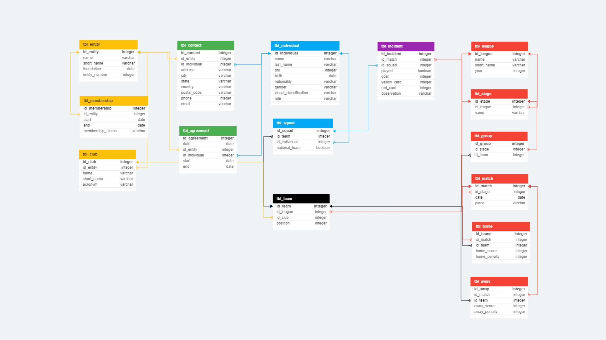

# Sports Federation Network

This project originates within a blind sports federation primarily dedicated to football. The main goal is to register and identify each individual, team, institution, or entity associated with federative competitions. Beyond this central objective, the project aims to address specific issues, including:

- **Historical Record:**
  - Storage and retrieval of historical results.
  - Identification of champions and top scorers over time.

- **Sanctions:**
  - Detailed recording of sanctions during matches.

- **First Player Match:**
  - Identification of the first match for each registered player.

- **Years at Each Club:**
  - Calculation of the number of years each player has been with a specific club.

- **Agreements between Individuals and Entities:**
  - Documentation of agreements and contracts between players and entities.

- **Unique Identification:**
  - Assignment of a unique ID to each player, coach, club, and federation entity.

  - **Image Storage:**
  - Appropriate nomenclature (ID) for storing profile images of individuals and club badges.

- **Team lists:**
  - Generation of team lists for each competition.

- **Geographical Distribution:**
  - Analysis of the geographical distribution of athletes.

- **Age Pyramid:**
  - Visualization of age distribution in competitions.

- **Talent Discovery:**
  - Identification of new talents and standout players.

- **Public Information:**
  - Making relevant information available to the community.

## Project Structure

### Database Tables

The database is organized into several tables to effectively manage and store information related to a sports federation for visually impaired athletes. Each table serves a specific purpose, and foreign key relationships are established to maintain data integrity. Here's a brief description of each table:

**tbl_entity:**
Stores information about entities (clubs, organizations, foundations, associations, etc.).
Includes details like name, short name, foundation date, and entity number.

**tbl_individual:**
Contains information about individual players, coaches, etc.
Includes details such as name, last name, ID number (DNI), birthdate, nationality, gender, visual classification, and role.

**tbl_club:**
Represents sports clubs and is linked to the tbl_entity table.
Includes information like club name, short name, acronym, and a foreign key referencing the entity.

**tbl_agreement:**
Captures agreements between entities and individuals.
Includes fields for the date, start and end dates of the agreement, and foreign keys linking to tbl_entity and tbl_individual.

**tbl_league:**
Stores information about sports leagues, including name, short name, and year.

**tbl_team:**
Represents sports teams within a league and is linked to tbl_club.
Includes fields for team position in the league.

**tbl_squad:**
Contains information about player squads within a team.
Includes details about the player, team, and whether it is a national team.

**tbl_stage:**
Represents stages within a league, linked to tbl_league.
Includes information about the stage name.

**tbl_match:**
Captures details about sports matches, including date, place, and a foreign key referencing the stage.

**tbl_incident:**
Records incidents during a match, such as goals, cards, and observations.
Includes foreign keys linking to tbl_match and tbl_squad.

**tbl_contact:**
Contains contact information associated with entities and individuals.
Includes details like address, city, state, country, postal code, phone, and email.

**tbl_group:**
Represents groups within a stage, linked to tbl_stage and tbl_team.

**tbl_membership:**
Records memberships of entities in leagues.
Includes start and end dates, membership status, and a foreign key referencing tbl_entity.

**tbl_home and tbl_away:**
Capture home and away scores in matches.
Include fields like match ID, team ID, scores, and penalties.

## Usage of SQL Files

The project has been organized into various SQL tables and views to facilitate the management and querying of information. MySQL was the chosen database management system to store and retrieve data efficiently.

- **`db_create.sql`:** Defines the structure of the tables in the database.

- **`db_insert.sql`:** Contains sample data for testing purposes while respecting individuals' privacy.

- **`db_view.sql`:** Creates views that facilitate the querying of relevant information, as examples of the data usage.

  - **`league_position`:** Displays the position of each team in the league for a specific year.

  - **`team_list`:** Presents a list of players from a specific team for a given year.

  - **`match_result`:** Provides details of match results, including venue, date, and winning team.

  - **`stage_table`:** Summarizes each team's performance in a specific stage, including matches played, won, drawn, and points.

  - **`top_scorers`:** Lists the top goal scorers, showing the number of goals per player and team.

  - **`entity_id`, `individual_id`, `club_id`:** Views for assigning a unique ID to entities, individuals, and clubs.

## Contributions

If you wish to contribute or have suggestions for improvement, feel free to do so! Contributions are welcome and appreciated.

## Author

- Agustín Germán Rojas
- Email: agustingermanrojas@gmail.com

## License

This script is open-source and free to use. Feel free to contribute and enhance its functionality.
